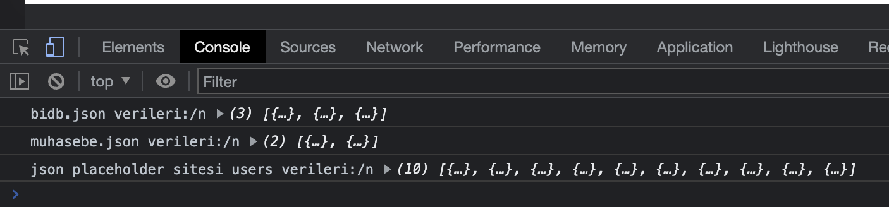
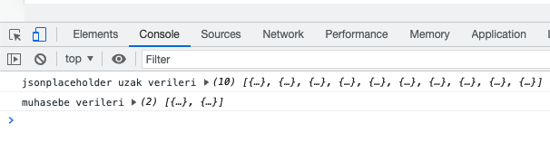

# `REACT-APOLLO ve GRAPHQL ile Uygulamalar Geliştirelim [2021]`

## Asenkron Javascript

### Callback fonksiyonu

`Fonksiyon içerisinde parametre olarak gönderilen fonksiyonlara callback fonksiyonlar denir.`

```js script
const getUsers = (callback) => {
    const xhr = new XMLHttpRequest()

    xhr.addEventListener('readystatechange', () => {
      // console.log(xhr,xhr.readyState);
      if (xhr.readyState == 4 && xhr.status == 200) {
        //console.log(xhr.responseText)
        callback(undefined, xhr.responseText)
        // Standart kullanım ilk paramtre hata, 2. parametrede doğru verinin paramtresi şeklinde
            // İlk parametre burada hata olmayacağından 'undefined' oluyor.
            // 2. parametrede de veri içeren 'xhr.responseText' oluyor.
      } else if (xhr.readyState == 4) {
        //console.log('Veri erişilemedi');
        callback('Veriye erişilemedi', undefined)
            // İlk parametre burada hata olacağından hata mesajı 'Veriye erişilemedi' görüntülenir.
            // 2. parametrede de veri olmadığından 'undefined' girilir.
      }
    })

    xhr.open('GET', 'https://jsonplaceholder.typicode.com/users');
    xhr.send();
}

getUsers((err,data)=>{
    if(err){
        console.log(err);
    } else {
        console.log(data);
    }
});
```

### JSON verilerle çalışma

```js script
    // Veriler JSON olarak döndürüldü.
    const data = JSON.parse(xhr.responseText); 
    callback(undefined, data);
```

### JSON verileri, paramtre ile ve iç içe fonksiyonlarla çağırma

```js script
const getUsers = (url, callback) => {
    const xhr = new XMLHttpRequest()

    xhr.addEventListener('readystatechange', () => {
      // console.log(xhr,xhr.readyState);
      if (xhr.readyState == 4 && xhr.status == 200) {
        //console.log(xhr.responseText)
        const data = JSON.parse(xhr.responseText); // Veriler JSON olarak döndürüldü.
        callback(undefined, data);
        // Standart kullanım ilk parametre hata, 2. parametrede doğru verinin parametresi şeklinde
            // İlk parametre burada hata olmayacağından 'undefined' oluyor.
            // 2. parametrede de veri içeren 'xhr.responseText' oluyor.
      } else if (xhr.readyState == 4) {
        //console.log('Veri erişilemedi');
        callback('Veriye erişilemedi', undefined);
            // İlk parametre burada hata olacağından hata mesajı 'Veriye erişilemedi' görüntülenir.
            // 2. parametrede de veri olmadığından 'undefined' girilir.
      }
    })

    xhr.open('GET', url)
    xhr.send();
}

const url = 'https://jsonplaceholder.typicode.com/users'

getUsers('users/bidb.json',(err,data)=>{
    if(err){
        console.log(err);
    } else {

        console.log('bidb.json verileri:/n', data);

        getUsers('users/muhasebe.json', (err, data) => {
          if (err) {
            console.log(err)
          } else {
            console.log('muhasebe.json verileri:/n', data);
            getUsers(url, (err, data) => {
              if (err) {
                console.log(err)
              } else {
                console.log('json placeholder sitesi users verileri:/n', data);
              }
            })
          }
        })
    }
});
```

`console sonucu`



### Promise yapısı

```js script
const veriGetir = () => {
   return new Promise((resolve,reject)=>{
       // Promise içerisinde callback fonksiyonu ve bu fonksiyonda 
       // resolve ve reject diye iki parametre bulunur.
        resolve('Veri başarıyla getirildi.');
        // resolve('Veri başarıyla getirildi');
        // Veri başarıyla getirildiyse reject çalışmaz.
        reject('Veri hatası');
        // Veri hatalı geldiyse, burası çalışır.
   })
};

veriGetir().then((data)=>{
    console.log(data);
}).catch((err)=>{
    console.log(err);
})
```

`const getUsers = (url, callback) fonksiyonunu promise` yapısına dönüştürüyoruz.

```js script
// const getUsers = (url, callback) fonksiyonunu promise yapısına çevirmek için callback'i kaldırıyoruz.
const getUsers = (url) => {

    return new Promise((resolve, reject)=>{
            const xhr = new XMLHttpRequest()

            xhr.addEventListener('readystatechange', () => {
              // console.log(xhr,xhr.readyState);
              if (xhr.readyState == 4 && xhr.status == 200) {
                //console.log(xhr.responseText)
                const data = JSON.parse(xhr.responseText) // Veriler JSON olarak döndürüldü.
                
                resolve(data); // callback yerine geldi.
               // callback(undefined, data);

                // Standart kullanım ilk parametre hata, 2. parametrede doğru verinin parametresi şeklinde
                // İlk parametre burada hata olmayacağından 'undefined' oluyor.
                // 2. parametrede de veri içeren 'xhr.responseText' oluyor.
              } else if (xhr.readyState == 4) {
                //console.log('Veri erişilemedi');

                reject('Veriye getirme hatası');
                //callback('Veriye erişilemedi', undefined);
                // İlk parametre burada hata olacağından hata mesajı 'Veriye erişilemedi' görüntülenir.
                // 2. parametrede de veri olmadığından 'undefined' girilir.
              }
            })
          xhr.open('GET', url);
          xhr.send();
    })
}

const url = 'https://jsonplaceholder.typicode.com/users';

getUsers(url).then((data)=>{
    console.log(data);
}).catch((err)=>{
    console.log(err);
});
```

### Promise zincirleri oluşturma

```js script
getUsers('https://jsonplaceholder.typicode.com/users').then((data) => {
    console.log('jsonplaceholder uzak verileri', data);
    return getUsers('/users/muhasebe.json');
  })
  .then((data) => {
    console.log('muhasebe verileri', data);
  })
  .catch((err) => {
    console.log(err)
  })
```

`Not:` ilk zincirde (jsonplaceholder uzak veri) hata olursa, ikinci zincir çalışmaz. catch bloğuna düşer.

`console sonucu`




### fetch ile veri çekme

```js script
const url = 'https://jsonplaceholder.typicode.com/users';

// ilk adım
// fetch(url).then((response)=>{
//     const data = response.json();
//     console.log(data);
// });

// ikinci adımla doğrudan veriye erişiyoruz.

fetch(url).then((response)=>{
    return response.json();
}).then((data)=>{
    console.log(data);
});
```
